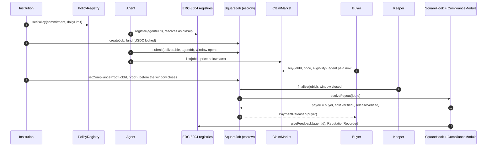

# From the mandate to the payment: the product in one flow

**Status:** the flow [#31][i31] asks for, written against `main` and rehearsed
on a fork of Arc Testnet on 2026-09-15 with the real ERC-8004 registries, a
module keyed to this build's prover, and the indexer and keeper running against
the fork. Not yet run on the shared Arc stack: that waits on the redeploy with
the module and the screening registry ([#324][i324], [#329][i329]) and on the
services running against Arc ([#336][i336]). When they are up, the run is one
command (below) and its report is the evidence [#31][i31] closes on.

[i31]: https://github.com/wienerlabs/square/issues/31
[i35]: https://github.com/wienerlabs/square/issues/35
[i100]: https://github.com/wienerlabs/square/issues/100
[i324]: https://github.com/wienerlabs/square/issues/324
[i325]: https://github.com/wienerlabs/square/issues/325
[i329]: https://github.com/wienerlabs/square/issues/329
[i335]: https://github.com/wienerlabs/square/issues/335
[i336]: https://github.com/wienerlabs/square/issues/336
[i345]: https://github.com/wienerlabs/square/issues/345
[i346]: https://github.com/wienerlabs/square/issues/346
[i368]: https://github.com/wienerlabs/square/issues/368
[i382]: https://github.com/wienerlabs/square/issues/382

## The sentence

An institution writes down what its agents may pay for, and never publishes
it. An agent does the work and is paid at once by selling what it is owed. The
escrow releases only against a proof that the payment fits the mandate, and
the record of the work stays with the agent, on ERC-8004. Eight steps, four
parties (the institution, the agent, a buyer of receivables, the keeper), one
chain.

## The eight steps

| # | Who | What happens | The call | The evidence on chain |
|---|---|---|---|---|
| 1 | the institution | commits its spending policy: the Poseidon commitment of the salted policy goes on chain, the policy itself does not ([public-daily-ceiling.md](../decisions/public-daily-ceiling.md)) | `PolicyRegistry.setPolicy(commitment, dailyLimit)`; `square policy commit`, the app's policy page | `PolicyCommitted` |
| 2 | the agent | registers in ERC-8004 and resolves as `did:aip` ([method-spec-v2.md](../did-aip/method-spec-v2.md)) | `IdentityRegistry.register(agentURI)`; `square register`, then `square resolve did:aip:eip155:5042002:<registry>:<agentId>` | the ERC-721 `Transfer` from the zero address; the DID document's controller is `did:pkh:eip155:5042002:<owner>` |
| 3 | the institution | opens a job for the agent and locks the USDC in escrow; on a hook that screens, both parties are screened before the funding leaves ([#368][i368]) | `createJob`, `setBudget` (the agent's price), `fund`; `square_hire`, the hosted agent's `delegate`, the app | `JobCreated`, `BudgetSet`, `JobFunded` |
| 4 | the agent | delivers; the challenge window opens | `submit(jobId, deliverable, optParams)` with the agent id in `optParams`, which the hook binds to the job; `square-hosted` | `JobSubmitted`, `SubmissionTimed`, the hook's `AgentBound`; `KeeperEvaluator.challengeEndsAt(jobId)` |
| 5 | the agent, a buyer | the agent lists its receivable below face; a buyer the institution's buyer list admits takes it ([buyer-eligibility.md](../decisions/buyer-eligibility.md)), and the agent holds the money now | `ClaimMarket.list(jobId, price)`; `PolicyRegistry.setBuyerRoot(root)` by the institution; `ClaimMarket.buy(jobId, price, salt, eligibility)` | `ClaimListed`, `BuyerRootCommitted`, `ClaimBought`; the hook's `payeeOf(jobId)` is now the buyer |
| 6 | the keeper | the window closes without a dispute; the keeper finalizes, paid its fee for the crank ([keeper-economics.md](keeper-economics.md)) | `KeeperEvaluator.finalize(jobId)`, from `services/keeper` | `Finalized(jobId, keeper, keeperFee)`, `JobCompleted`, a row in the keeper's journal (`/actions`) |
| 7 | the institution's software, the module | the release asks for the proof: the payment, as the chain makes it now (payee, net, token, the day's counter, the clock), fits the committed policy ([compliance-gate.md](compliance-gate.md)) | `SquareJob.setComplianceProof(jobId, proof)`, bound by the institution's duty before the window closes ([proof-freshness.md](../decisions/proof-freshness.md)); read by `SquareHook.resolvePayout` at release | `ComplianceProofSet` when bound; `ReleaseVerified` at release, or `ReleaseRefused` with the reason and the whole net back to the institution |
| 8 | the chain | the payment goes to the buyer; the reputation goes to the agent that did the work, and the gate's verdict to the validation registry | the kernel's pull-payment ledger (`withdraw`); the hook's writes to `ReputationRegistry` and `ValidationRegistry` | `PaymentReleased(jobId, buyer, amount)`, `PayoutRouted`, `ReputationRecorded(jobId, agentId, ...)`, `ValidationRecorded` |



## What the order says

**The proof is bound before the release, not by it.** Step 7 sits between the
sale and the crank because the proof is a statement about the release as the
chain will make it: the payee is the buyer once the receivable is sold, and the
day's counter and the clock move until the block that releases. The institution's
duty (`square policy watch`, `square-mcp`, `square-hosted`) keeps the proof on
the job current and cranks itself once the window closes; a keeper's crank that
lands first is read back as the settlement ([proof-freshness.md](../decisions/proof-freshness.md)).
The keeper knows nothing of the proof: to it a job with a current proof is a job
like any other, which is why step 6 is the keeper's and step 7 the institution's.

**A refusal is a split, never a revert.** The module answers `resolvePayout`
with a split, and a proof the mandate refuses pays the provider nothing and
returns the net to the institution, with the reason on chain ([#100][i100],
[compliance-gate.md](compliance-gate.md)). A proof that is merely missing holds
the escrow: the evaluator refuses the crank with `ProofRequired` until the
institution binds one ([proof-required.md](../decisions/proof-required.md),
[#382][i382]); the stack deployed today, from before that change, refunds it
the same way as a refusal until the redeploy.

**The buyer is paid, the agent is credited.** The hook resolves the payee from
the market (`payeeOf`) and writes the reputation for the agent bound at
`submit`, whoever the money went to. Selling the receivable moves the money
forward in time; it does not move the record of the work.

**Screening, when the hook screens.** With a screening registry installed
([#35][i35], [sanctions-screening.md](../decisions/sanctions-screening.md)),
step 3 screens the institution and the agent before the funding leaves, and the
release in step 6 pays nothing to a payee without a fresh clean record; the
keeper and the duty hold such a job rather than crank it into the refusal.

## Running it

`packages/core/scripts/lifecycle.ts` runs seven settlement paths; the sixth
(`6-receivable`) is these eight steps, and the report it writes carries them
as a table of their own, "The eight steps", with the transaction and the gas
of each row. On a chain a keeper watches, run it with
`LIFECYCLE_FINALIZER=keeper`: the runner then binds the proofs, leaves every
settlement to the keeper, waits for the job to leave `Submitted`, and records
the keeper's transaction and the address that sent it. Without it the runner
cranks itself, which on a chain with a keeper only races it and loses with
`NotSubmitted`.

```bash
# the shared stack, once it carries the module and a keeper runs against it (#324, #336)
LIFECYCLE_FINALIZER=keeper REGISTER_AGENT=1 \
LIFECYCLE_POLICY_FILE=~/.square/lifecycle-policy.json LIFECYCLE_PROVER_ARTIFACTS=services/prover/artifacts \
packages/core/scripts/lifecycle-arc-testnet.sh
```

The runner proves in its own process from the circuit's files, as the
institutions' tools do ([#347](https://github.com/wienerlabs/square/issues/347));
the files have to be the ones the shared stack's verifier is keyed to
([#353](https://github.com/wienerlabs/square/issues/353)). `LIFECYCLE_PROVER_URL`
names a prover service instead, which is what CI's gated run uses. In keeper
mode the Arc script funds `BUDGET_USDC=6` and `FUND_CLIENT=45` unless told
otherwise, for the reason below.

Two things the run needs on a shared chain that the local stack does not:

- **Budgets above the keeper's bar.** The keeper cranks only what pays for its
  gas: `minimumProfitableBudget` with the deployed `EVALUATOR_FEE_BP` of 50,
  its `FINALIZE_GAS` and `MINIMUM_MARGIN_BPS` ([keeper-economics.md](keeper-economics.md)).
  A job under the bar is journaled as unprofitable and never finalized, and the
  runner times out on it (`LIFECYCLE_SETTLEMENT_TIMEOUT_MS`, 10 minutes). At
  Arc's 21 gwei and the keeper's defaults the bar is about 2.3 USDC a job. A
  gated finalize costs 1.0 to 1.2 M gas on the fork rather than the 450 000 the
  keeper assumes ([#344](https://github.com/wienerlabs/square/issues/344)), so
  `BUDGET_USDC=6` keeps the crank paid at its real cost too, and `FUND_CLIENT`
  has to cover six funded jobs, their bonds and the gas: the Arc script's
  keeper-mode defaults.
- **Fresh actors.** Arc Testnet refuses anvil's published accounts:
  `register()` from them reverts, and the RPC answers `Blocked address` for
  some. `lifecycle-arc-testnet.sh` already draws fresh keys into
  `LIFECYCLE_ACTORS_FILE` on the first run; a fork of Arc needs the same.

The proof timing in keeper mode is the runner's, not the duty's: it binds each
proof once, when the release is within half the module's tolerance, and refuses
to start a path whose window is further out than that, since the proof would be
stale by the time the keeper reads it. For the two decided disputes it binds
before the deciding vote, for the split that vote sets, which a real institution
cannot do: that race is [#345][i345]'s, on the keeper's side.

## Measured

Rehearsed on 2026-09-15 against `anvil --fork-url https://rpc.testnet.arc.io`
with `DeploySettlement` at 45 s / 90 s / 120 s windows, a mock escrow token
(the fork cannot move Arc's native-USDC ERC-20), this build's module installed
by `packages/policy/scripts/install-module-for-this-build.mjs`, and
`services/indexer` and `services/keeper` on a Postgres, `LIFECYCLE_FINALIZER=keeper`:
the provider registered as agent `895231` on the forked registry and resolved
with itself as controller; the four settlements (`1-optimistic`,
`2b-dispute-provider-wins`, `2c-dispute-split`, `6-receivable`) were sent by the
keeper, each with `ReleaseVerified`; the receivable's release paid the buyer
4.925 USDC of a 5 USDC budget and recorded reputation for the agent. The
keeper's journal also showed [#325][i325] as filed: two `WindowOpen` reverts
from a crank a second before the chain's clock reached the close, retried on
the next tick.

The figures that count are the shared stack's. Until that run,
[docs/deploy/lifecycle-5042002-2026-09-09.md](../deploy/lifecycle-5042002-2026-09-09.md)
is the last lifecycle on Arc: the 2026-09-09 stack, without a module, the
runner cranking, so steps 1 and 7 are not in it.
